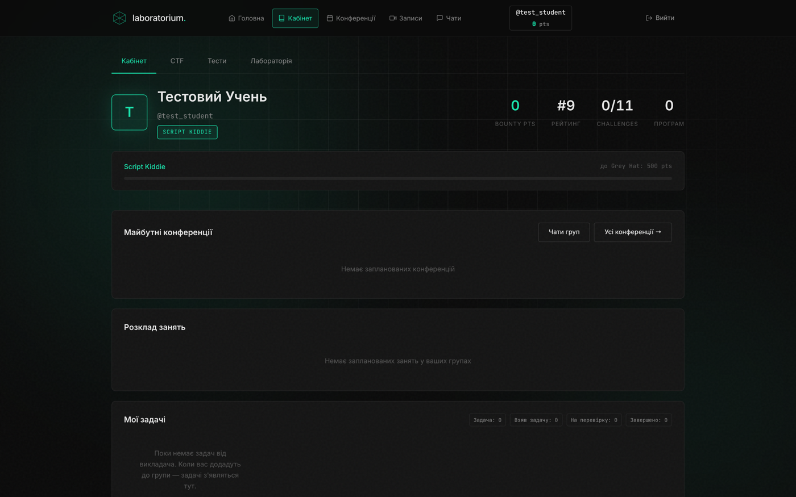

# laboratorium.

**Просунута школа IT та кібербезпеки** — бекенд, особистий кабінет, CTF-лабораторія, відеоконференції та чати, все в Docker.

<p>
  
  
  
  
  
  
  
</p>



## Можливості

- 🎯 **CTF-лабораторія** — challenges з рейтингом, tier-система (Script Kiddie → Grey Hat → White Hat)
- 🖥️ **Особиста VM** для кожного учня через Proxmox + Docker-агент
- 🎥 **Відеоконференції** та записи занять
- 💬 **Груп-чати** в реальному часі на Socket.IO
- 📊 **Адмін-панель** — користувачі, оплати, розклад, статистика, доступи
- 🔐 **Закрита реєстрація** — доступ видається вручну після оплати
- 📅 **Розклад занять** та прогрес по програмах

## Швидкий старт (Docker)

```bash
cp .env.example .env   # відредагуйте JWT_SECRET
docker compose up -d --build
```

Сайт: **http://localhost:3000**

**Production на сервері:** див. [DEPLOY.md](./DEPLOY.md) — Docker (app + nginx + HTTPS), `.env`, CTF-образ.

### Вхід власника

Акаунт власника **не** створюється з паролем із репозиторію. Задайте `OWNER_EMAIL` і `OWNER_PASSWORD` у `.env` лише для першого створення (існуючий пароль на рестарті не перезаписується), або створіть власника через `BOOTSTRAP_EMAIL` / `BOOTSTRAP_PASSWORD` на порожній базі.

**Можливості власника:** керування напрямками та програмами, зміна ролей, створення акаунтів після оплати, надсилання пароля на email.

Реєстрація на сайті **закрита** — доступ видається вручну через адмінку після оплати.

Для email (скидання пароля, надсилання доступу) налаштуйте `SMTP_*` у `.env`. Без SMTP у dev-режимі листи виводяться в консоль сервера.

```bash
docker compose logs -f app   # логи
docker compose down          # зупинка
```

## Локальна розробка

```bash
cp .env.example .env
npm install
npm run dev
```

Після оплати власник створює акаунт у `/admin.html` → вкладка **Користувачі**.

---

## Архітектура бекенду

```
server/
├── index.js              # Точка входу, graceful shutdown
├── app.js                # Express-застосунок
├── config/                # Конфігурація з .env
├── db/
│   ├── index.js          # SQLite + WAL
│   ├── schema.js         # Схема БД + індекси
│   └── seed.js           # Демо-дані
├── middleware/
│   ├── auth.js           # JWT
│   ├── errorHandler.js   # Централізовані помилки
│   └── logger.js         # Логування запитів
├── services/              # Бізнес-логіка
│   ├── user.service.js
│   ├── program.service.js
│   ├── challenge.service.js
│   ├── bounty.service.js
│   └── application.service.js
├── controllers/           # HTTP-обробники
├── routes/                 # Маршрути
└── utils/                  # Помилки, валідація, tier
```

### Принципи

- **Шари**: routes → controllers → services → db
- **Помилки**: типізовані `AppError` з кодами
- **Безпека**: helmet, rate-limit, bcrypt, JWT
- **Конфіг**: усе через `.env`
- **БД**: SQLite з WAL, volume у Docker для персистентності
- **Healthcheck**: `GET /api/health` з метриками

## API

| Метод | Шлях | Auth | Опис |
|-------|------|------|------|
| GET | `/api/health` | — | Health + статистика БД |
| POST | `/api/auth/register` | — | Реєстрація |
| POST | `/api/auth/login` | — | Вхід |
| GET | `/api/auth/me` | ✓ | Поточний користувач |
| GET | `/api/programs` | — | Програми |
| GET | `/api/leaderboard` | — | Рейтинг |
| POST | `/api/applications` | opt | Заявка |
| GET | `/api/dashboard` | ✓ | Особистий кабінет |
| POST | `/api/enroll` | ✓ | Запис на програму |
| POST | `/api/challenges/:id/complete` | ✓ | Здати challenge |
| PATCH | `/api/profile` | ✓ | Профіль |
| PATCH | `/api/enrollments/:id/progress` | ✓ | Прогрес |

## Змінні оточення

| Змінна | За замовчуванням | Опис |
|--------|-------------------|------|
| `PORT` | `3000` | Порт сервера |
| `JWT_SECRET` | — | Секрет JWT (обов'язково; сервер не стартує без нього) |
| `DATABASE_PATH` | `./data/laboratorium.db` | Шлях до SQLite |
| `SEED_DATABASE` | `true` | Заповнити програмами та challenges (без хардкод-акаунтів) |
| `CORS_ORIGIN` | — | Дозволені origin (у production обов'язково, не `*`) |
| `RATE_LIMIT_MAX` | `100` | Ліміт запитів / 15 хв |
| `AUTH_RATE_LIMIT_MAX` | `20` | Ліміт на auth / 15 хв |

## Docker

- **Multi-stage build** — компіляція `better-sqlite3` у builder
- **Non-root user** `lab` (uid 1001)
- **Volume** `lab-data` для SQLite та uploads
- **Healthcheck** `GET /api/health`
- **Production:** `docker-compose.prod.yml` — app + nginx у Docker, [DEPLOY.md](./DEPLOY.md)
- **CTF:** `npm run ctf:build` → образ `laboratorium/ctf-lab:latest`

## Стек

| Шар | Технології |
|-----|------------|
| Frontend | HTML, CSS, vanilla JS |
| Backend | Node.js 20+, Express |
| Realtime | Socket.IO |
| БД | SQLite (better-sqlite3) |
| Auth | JWT + bcrypt |
| Інфраструктура | Docker, Proxmox (особисті VM) |
